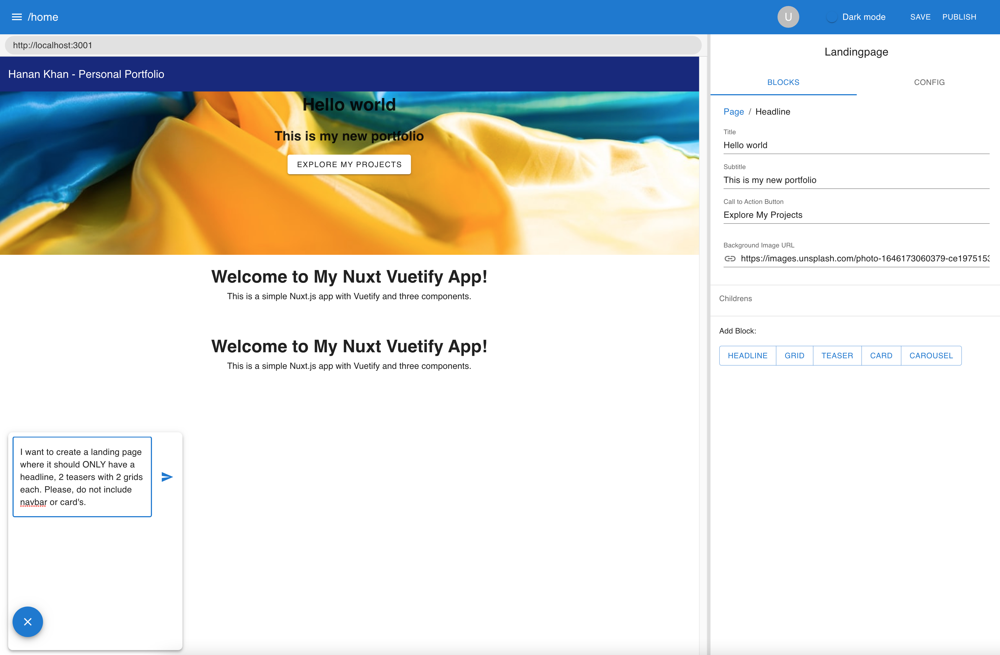
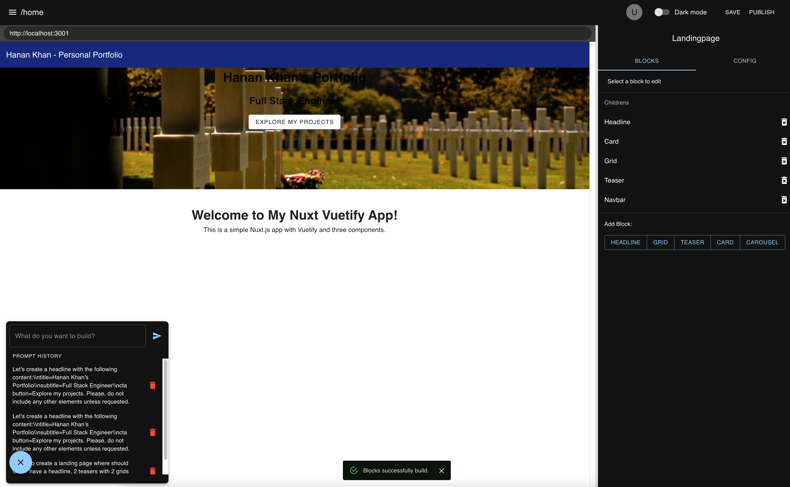

# Talk CMS

Talk is an experimental headless CMS designed for seamless integration with ChatGPT by OpenAI for automatic landing page creation. It is inspired by Storyblok, a popular headless CMS, and aims to provide a user-friendly way to build and manage content for your web projects.




## Features

- Headless CMS with a visual editor
- Integration with ChatGPT for automatic landing page generation
- Modular block-based content structure
- Extensible and customizable to suit your needs
- TanStack Start server rendering and file-based API routes

## Getting Started

### Prerequisites

- Node.js 22.22.2 or newer
- npm 10 or newer
- A modern web browser

The Node.js minimum includes the requirements of TanStack Start, Vite, ESLint, and jsdom.

### Installation

1. Clone the repository and enter it:

```sh
git clone https://github.com/your-username/talk-cms.git
cd talk-cms
```

2. Install dependencies with npm:

```sh
npm install
```

3. To use the block-builder API, create `.env.local` in the project root:

```dotenv
VITE_VISUAL_COMPOSER_URL=https://your-preview-site.example?editMode=true
OPENAI_API_KEY=your_openai_api_key
OPENAI_ORG_ID=your_optional_openai_organization_id
UNSPLASH_ACCESS_KEY=your_unsplash_access_key
```

`VITE_VISUAL_COMPOSER_URL` controls the site shown in the visual-composer iframe.
When it is omitted or invalid, the preview area remains empty. The OpenAI and
Unsplash values are only read when `/api/block-builder` handles a request and
are not required to run or test the rest of the application.

### Development

```sh
npm run dev
```

The server listens on [http://localhost:3000](http://localhost:3000).

The TanStack Start home and API routes are defined in `src/routes`.

### Validation

```sh
npm run lint
npm run typecheck
npm test
npm run test:e2e
npm run build
```

### Production

```sh
npm run build
npm start
```

The production entry point is `.output/server/index.mjs` and uses port 3000.

### Docker

Build and run the production image with Docker Compose:

```sh
docker compose up --build
```

An `.env.local` file is optional for startup and required only when using the OpenAI/Unsplash-backed block builder.

## API Routes

- `GET /api/hello` returns `{ "name": "John Doe" }`.
- `POST /api/block-builder` accepts `{ "input": ... }` and returns flattened page blocks, a validation error with status 400, or the existing generic processing error with status 500.

## Contributing

If you'd like to contribute to the Talk CMS project, please open an issue or submit a pull request on the GitHub repository.

## License

Talk CMS is licensed under the [MIT License](LICENSE).
